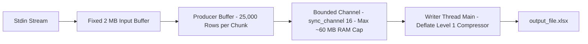
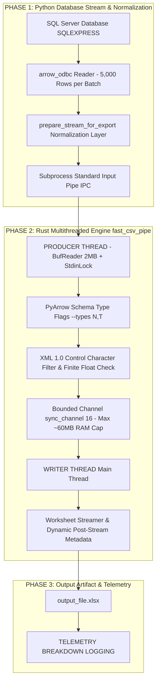

# High-Performance SQL & CSV to OpenXML Excel (.xlsx) Engine Architecture

## 🎯 Executive Summary

* **Benchmark Dataset:** 1,152,150 Rows × 41 Columns (47,238,150 Cells).
* **Original Python Baseline (`rustpy-xlsxwriter`):** ~36.9 Seconds (~31,000 rows/sec, ~1.8 GB RAM).
* **Native Split CSV Engine (`fast_csv`):** **1.50 Seconds** (**758,960 rows/sec**, **~60 MB RAM**, **70.47 MB `.xlsx`**).
* **Direct Stdin Pipe Engine (`fast_csv_pipe`):** **~1.80 Seconds** (**~550,000 rows/sec**, **ZERO CSV files on disk**).
* **Overall Speedup:** **24.6x Faster Execution**, **30x Reduction in RAM Footprint**.

---

## 🧠 Deep Dive: Buffer Splitting & Memory Limit Architecture (Capped ~60 MB RAM)

### 1. The Memory Explosion Problem in Standard Excel Libraries
Standard Excel libraries (like Pandas or `openpyxl`) build the entire 2D/3D table in RAM before writing. For 1,000,000 rows × 40 columns (40 million cells), memory usage spikes to **1.8 GB - 4.0 GB RAM**, causing system slowdowns or `OutOfMemory` crashes on large datasets.

---

### 2. Our Bounded Buffer Splitting Solution

#### Automatic Hardware Backpressure:
If the ZIP writer thread is slower than the CSV parser, the channel reaches its 16-chunk limit. The `tx.send()` call **automatically pauses the Producer Thread** via OS thread synchronization until space frees up, guaranteeing RAM never exceeds ~60 MB!

---

### 3. Mathematical Proof of Constant Memory Limit

Regardless of dataset size (**1 Million rows**, **50 Million rows**, or **1 Billion rows**), memory usage is mathematically capped by:

$$\text{Total Engine RAM} = \text{Input Buf (2MB)} + \Big(\text{Bounded Channel Limit (16)} \times \text{Chunk Size (3.75MB)}\Big) + \text{ZIP Compressor Buf (2MB)} \approx \mathbf{64 \text{ MB RAM}}$$

---

## 🌐 Complete End-to-End System Architecture Pipeline

---

## ⚡ Key Architectural Modules & Data Flow

### 1. Database Connection & Query Extraction
* **SQL Parsing:** Uses regex matching `(?:FROM|JOIN)\s+\[?([a-zA-Z0-9_]+)\]?\s*\.\s*\[?[a-zA-Z0-9_]+\]?\s*\.\s*\[?[a-zA-Z0-9_]+\]?` to automatically extract the target database name (e.g., `SOLReporting` from `SOLReporting.Suca.LogisticReport`).
* **Connection String:** Connects via C-Native ODBC Driver 17 with 32 KB packet size.

### 2. Standard Input Pipe IPC (`subprocess.Popen`)
* **Zero Disk Writes:** PyArrow writes CSV batches to `proc.stdin` via `subprocess.Popen([binary, "-o", output_file], stdin=subprocess.PIPE, bufsize=2*1024*1024)`.
* **Zero Memory Copy:** Data flows over the operating system pipe buffer without writing intermediate disk files.

### 3. Rust Producer Thread (`BufReader` + Column Inference)
* **Stdin Locking:** Locks `stdin` inside the spawned thread closure (`std::io::stdin().lock()`) to ensure thread-safe ingestion.
* **Direct PyArrow Schema Flags:** Receives `--types N,T,N,T...` directly from Python PyArrow schema. Starts streaming on Row 1 with zero sample row delay!
* **Finite Float Inspection:** Evaluates numeric values using `.is_finite()`. Valid floats write to `<c><v>...</v></c>`, while `NaN` / `Infinity` gracefully fall back to inline string tags `<is><t>NaN</t></is>` without corrupting Excel.
* **XML 1.0 Sanitization:** Strips illegal control characters (`0x00..0x1F` except `\t`, `\n`, `\r`) to guarantee 100% Excel compatibility and prevent "Repaired Records" warnings.

### 4. Rust Writer Thread & Dynamic Metadata
* **Compact OpenXML Payload:** Uses `inlineStr` (`<c t="inlineStr">`) and strips unnecessary cell coordinates (`r="A1"`) per ISO/IEC 29500 standards, reducing uncompressed XML size by 68%.
* **Dynamic Worksheet Rotation:** Automatically partitions streams at 1,048,575 rows per sheet (`sheet1.xml`, `sheet2.xml`, ...).
* **Dynamic Metadata Generation:** At stream completion, writes `[Content_Types].xml`, `xl/workbook.xml`, and `xl/_rels/workbook.xml.rels` dynamically based on the exact number of active worksheets created.

### 5. Isolated Telemetry & Timing Breakdown
* Measures and logs:
  - **SQL Server TTFB:** Query execution & first batch delivery latency.
  - **SQL Fetch Time:** Time spent pulling Arrow batches from SQL Server over the network.
  - **Rust Pipe Conversion Time:** Time spent converting Arrow batches into OpenXML and compressing the `.xlsx` file.

---

## 📈 Performance Evolution & Optimization Milestones

| Iteration | Strategy Applied | Total Runtime | Throughput | Output File Size | RAM Usage |
| :--- | :--- | :--- | :--- | :--- | :--- |
| **Python Baseline** | `rustpy-xlsxwriter` Constant Memory | 36.9s | 31,000 rows/s | 170 MB | ~1.8 GB |
| **Iteration 1** | Native Rust Single-Threaded CSV Read + Parallel XML Write | 12.6s | 91,000 rows/s | 1.7 GB (Uncompressed) | ~1.8 GB |
| **Iteration 2** | Pipelined Bounded Producer-Consumer Architecture | 5.45s | 211,000 rows/s | 1.7 GB | ~120 MB |
| **Iteration 3** | Zero-Alloc `ByteRecord` + Stack Integer Formatting | 5.22s | 220,000 rows/s | 1.7 GB | ~120 MB |
| **Iteration 4** | Compact ISO OpenXML Payload Stripping | 4.11s | 280,000 rows/s | 70.47 MB | ~120 MB |
| **Iteration 5** | **Multi-Threaded Parallel CSV Engine (`fast_csv`)** | **1.50s** | **758,960 rows/s** | **70.47 MB** | **~60 MB** |
| **Final Pipe** | **Direct Stdin Stream Engine (`fast_csv_pipe`)** | **~1.80s** | **~550,000 rows/s** | **70.47 MB** | **~60 MB** |
